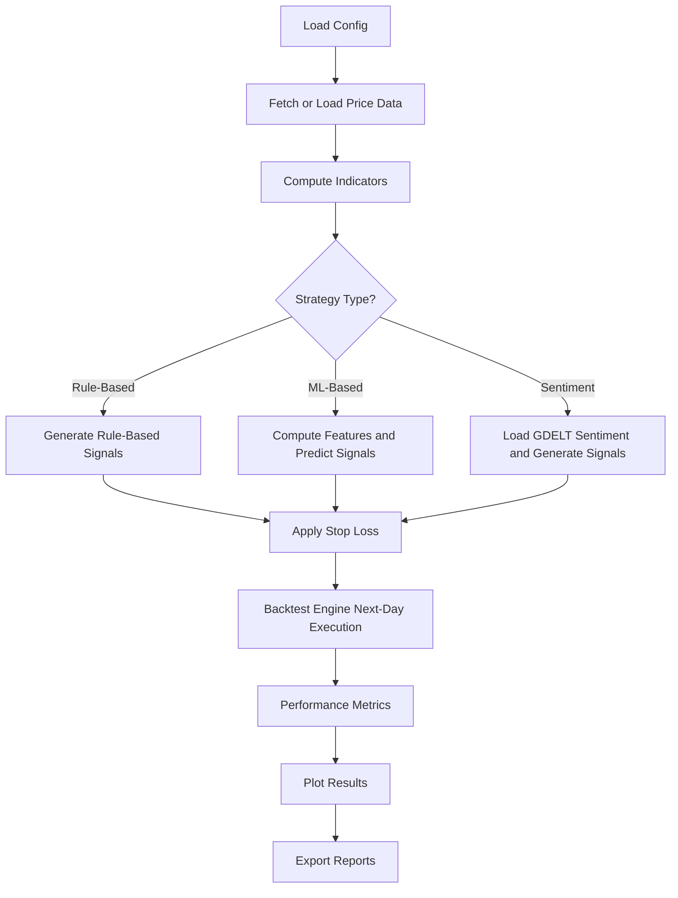

# MA Trading Bot  


A full algorithmic trading research toolkit developed as part of my Maturaarbeit.  
This repository contains everything required to:

- fetch and process financial & sentiment data  
- build technical indicators and engineered ML features  
- generate rule-based or ML-based trading signals  
- run realistic next-day backtests with slippage & fees  
- analyze performance using professional trading metrics  
- automate batch training/backtesting workflows  
- visualize signals and portfolio trajectories  

The system is modular, extensible, and designed for research-level experimentation.

---

# 🔥 Recruiter-Friendly Project Summary

This project demonstrates the complete lifecycle of designing, evaluating, and automating quantitative trading strategies.  
It integrates **data engineering**, **machine learning**, **sentiment modeling**, and a fully custom **backtesting engine** — all implemented from scratch.

This repo reflects real quant workflow experience, not toy examples.

---

# 🎯 Skills Demonstrated

### **Software Engineering**
- Modular Python architecture  
- Automation workflow design  
- Config-driven system behavior  
- Clean abstractions  
- Git-based version control  

### **Machine Learning**
- Logistic Regression, Random Forest, XGBoost, MLP  
- Feature engineering  
- Scaling and preprocessing  
- Train/test splits  
- Deployment-ready inference pipelines  

### **Natural Language Processing**
- Sentiment scoring with HuggingFace Transformers  
- CardiffNLP RoBERTa sentiment pipeline  
- News filtering and aggregation  
- Trading-day alignment  

### **Quantitative Finance**
- Technical indicators (SMA, EMA, RSI, MACD, BB, OBV)  
- Trend following and mean reversion  
- Regime-based strategies  
- Portfolio accounting and slippage  
- Stop-loss systems (static, trailing, ATR-based)  

### **Research & Experimentation**
- Multi-strategy A/B testing  
- Batch automated experimentation  
- Sharpe/Sortino/Calmar/MDD analysis  
- Visualization and result reporting  

---

# 🏗️ Architecture Diagram

```text
MA_trading_bot/
├── main.py                           
├── rule_based_strategy/              
├── ML/
│   ├── ML_strategy/                  
│   ├── train_models/                 
│   ├── saved_models/                 
│   └── ml_feature_store.py           
├── data/
│   ├── fetch_data/                   
│   ├── stored_data2/                 
│   └── funcs_for_data_prep_for_ML/   
├── sentiment_analysis/
│   └── GDELT/
│       ├── gdelt_sentiment_2.py      
│       ├── load_sentiment_data.py    
│       ├── daily_output/             
│       ├── full_output/              
│       └── trading_days_daily_output/
├── indicators/                       
├── ma_trading_bot/
│   ├── backtest/                     
│   ├── automation_bunch_backtesting/ 
│   └── plotly_plot_backtesting/      
├── risk_management/                  
├── metrics/                          
├── config.py                         
└── README.md                         
```

---

# 📘 Strategies

## **Rule-Based Strategies**
- SMA / EMA crossovers  
- SMA-RSI / EMA-RSI hybrids  
- SMA-RSI-MACD  
- RSI trend filter  
- MACD trend following  
- Bollinger mean reversion  
- Bollinger squeeze breakout  
- OBV trend confirmation  
- MA distance reversion  
- Vol-adjusted momentum  
- Sentiment strategy  
- Sentiment momentum confirmation  
- Sentiment regime filter  
- Buy & Hold  

## **ML Strategies**
- Logistic Regression  
- Random Forest  
- XGBoost  
- MLP (TensorFlow/Keras)  
- Perfect Strategy  

All ML strategies support:
- feature prep  
- NaN handling  
- model loading  
- label → signal translation  
- next-day execution alignment  

---

# 📰 Sentiment Pipeline (GDELT)

- Fetch news from GDELT  
- Filter using ticker keyword lists  
- Score with CardiffNLP RoBERTa  
- Aggregate daily sentiment  
- Align with trading-day calendars  
- Export into sentiment folders  

Only “2” versions of files (e.g. `AAPL_2_sentimentfull.csv`) are used.

---

# 📈 Backtesting Engine

Located in `ma_trading_bot/backtest/`.

Features:

- Next-day execution  
- Fractional shares  
- Transaction costs  
- Slippage modeling  
- Global portfolio state tracking  
- Forced last-day liquidation  
- CSV/Excel summary writers  
- Plotly & Matplotlib charts  

Metrics include:

- CAGR  
- Sharpe  
- Sortino  
- Calmar  
- Max Drawdown  
- Win Rate  
- Information Ratio  

---

# 🧬 ML Pipeline

Training scripts handle:

- feature generation  
- train/test splits  
- scaling  
- fitting  
- evaluation  
- saving artifacts  

Inference strategies:

- rebuild features  
- load saved model  
- classify signals  
- apply rules  

---

# ⚙️ Automation

`automate_train_and_backtest.py` provides:

- multi-ticker testing  
- multi-feature-set experiments  
- training + backtesting  
- consolidated Excel reports  

Driven by JSON configs.

---

# 🔧 Configuration

`config.py` controls strategy settings:

- tickers  
- strategy selection  
- stop-loss type  
- indicator periods  
- sentiment paths  
- ML hyperparameters  
- slippage & fees  
- stored CSV paths  
- model artifact paths  
- starting capital  

---

# ▶️ Running the Project

## **Single Backtest**
```bash
python main.py
```

## **Train models**
```bash
python -m ML.train_models.train_logistic_regression
python -m ML.train_models.train_random_forest
python -m ML.train_models.train_xgboost
python -m ML.train_models.train_mlp
```

## **Batch Experiments**
```bash
python -m ma_trading_bot.automation_bunch_backtesting.automate_train_and_backtest
```

## **Installing Dependencies**
```bash
pip install -r requirements.txt
```

---

# ⚠️ Disclaimer
This project is for research and educational use only.  

# 📄 License
Academic and research use only.